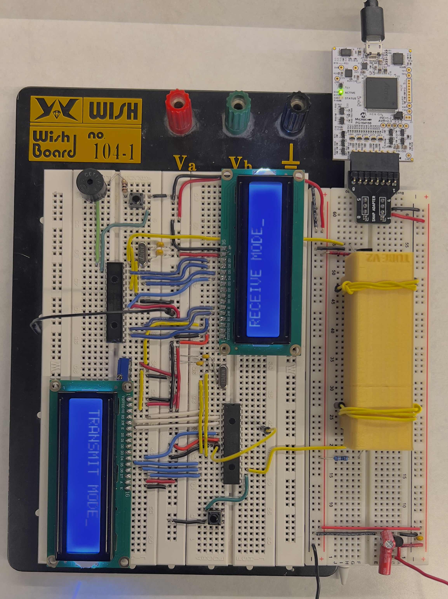
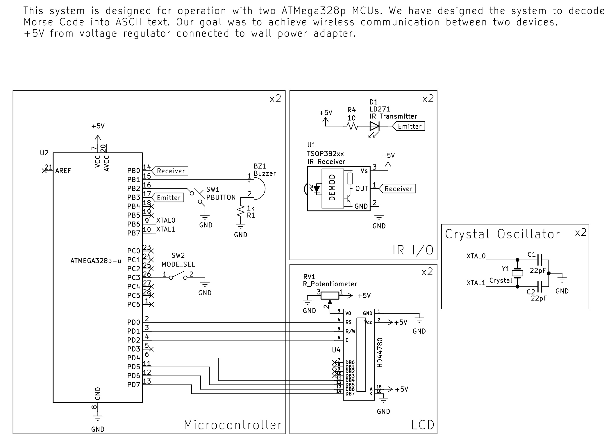

# Morse Code Transceiver.

 This started as the final assignment for our ECE 312 microcontrollers class. Our team built both the hardware and firmware to send and receive Morse code using the ATmega328p, an LCD display, a piezo buzzer and infrared transmitter and receiver.

## Overview

- **Platform**: ATmega328p with avr-libc
- **Display**: HD44780 LCD for user feedback
- **Input/Output**: push button for manual transmission, IR emitter/receiver pair, and a buzzer for audio
- **Modes**: transmit and receive switchable via a slide switch
- **Power**: hacked together power supply with a small Linear Regulator circuit for power

The firmware is all written in C using the AVR-GCC toolchain. It's pretty straightforward, but getting all the timing right for Morse code took a lot of tweaking.

## How It Works

1. **Transmit Mode**
   - Hold the push button to select a dot or dash. `transmit()` reads the hold time using `get_timeBUTTON()` and then sends the corresponding IR pulse via `IRtransmit()`.
   - The LCD shows what you are about to send and confirms once the pulse is transmitted.

2. **Receive Mode**
   - The IR receiver triggers an interrupt captured in `recieve()`. Depending on the timing between pulses, we decode a dot, dash, letter separator, or space.
   - Characters are identified with ASCII LUTs and displayed on the LCD. The buzzer gives audio feedback for each symbol.

3. **Morse Buffering**
   - Received dots and dashes are stored in `morse[]`. When an end-of-character signal arrives, the string is compared against the `morse_table` for a match and appended to `messageBuffer`.

Check out `firmware/src/main.c`for all the **juicy** details. 

## Hardware

The schematic below lays everything out. Highlights include:

- Two ATmega328p chips (because you always need a friend to chat with)
- IR LED and photodiode pair for optical data transfer
- Piezo buzzer for audible Morse tones
- LCD wired in 4-bit mode

Check the `kicad/` folder which has the schematic if you want to look at exactly how things are connected!

## Building & Flashing

You'll need AVR-GCC and `avrdude` installed. After wiring the circuit, compile and flash (twice if you want the pair) using your favorite make process. The repo doesn't include a Makefile (we used MPLABX :/), but `avr-gcc` with the proper flags works great.

```bash
avr-gcc -mmcu=atmega328p -DF_CPU=14745600UL -Os -o main.elf firmware/src/*.c
avr-objcopy -O ihex main.elf main.hex
avrdude -c <programmer> -p m328p -U flash:w:main.hex
```

Tweak the F_CPU definition in `main.h` if you use a different crystal.

## Extras

You can find below an image of the project, as well as the project schematic.

### Images




#### links
1. [github repo](https://github.com/pyarya/at_morse)
