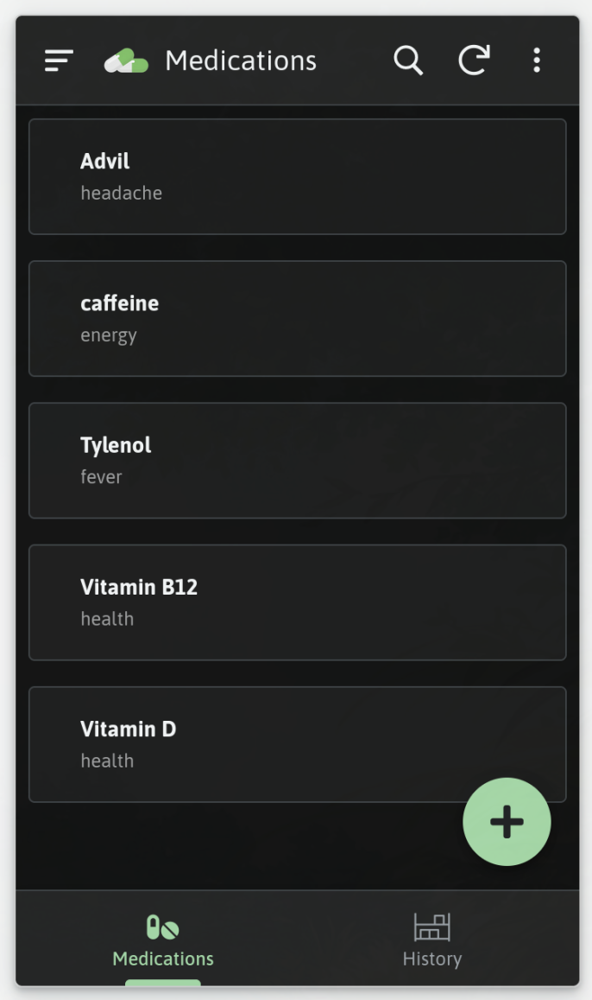
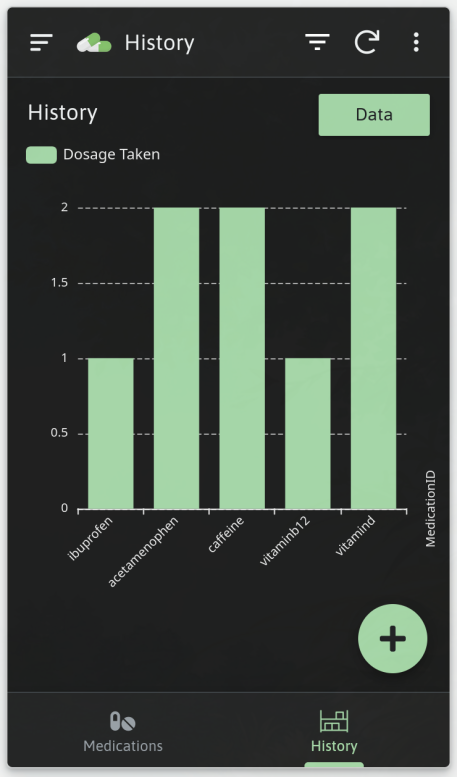
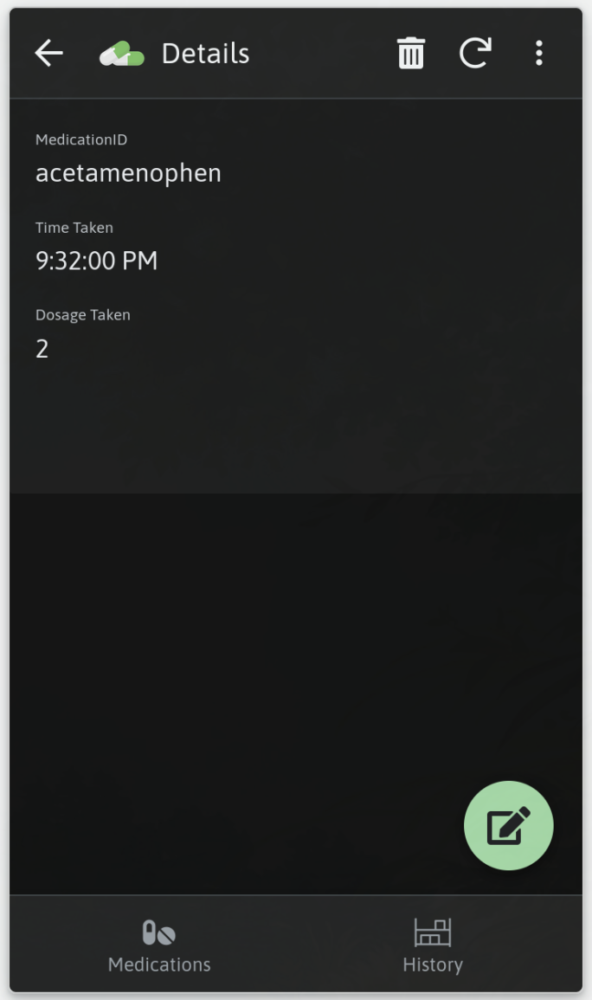

## Introduction
We made a pill tracker as a hackathon (HackED 2024) project to addresses medication management challenges. Significantly more useful than its predecessor... the [Shawarma Sheriff](/posts/shawarma-sheriff)

## Overview
The PillPal combines hardware components, including an Arduino and ESP32, connected to an easy-to-use app created through Google AppSheets that allows anyone to track their medication and recieve physical and digital reminders.

### Hardware Components:
- **Arduino**: Powers OLED screen to display medication details.
- **OLED Screen**: Displays upcoming medication details to the user.
- **Buzzer**: Provides audible reminders for medication intake.

### Software Components:
- **Google App Sheets**: Custom app created using AppSheets to track medication data.
- **CSV File**: Stores medication data for each user.
- **ESP32**: Communicates with Google App Sheets via the Google Workspace API to fetch medication data.
- **Serial Communication**: Connects the ESP32 to the Arduino to transmit medication data.

## How It Works
1. **Data Tracking**: Users input their medication details into the Google App Sheets app.
2. **Data Retrieval**: The ESP32 fetches medication data from the a spreadsheet and the Google Workspace API.
3. **Data Transmission**: The ESP32 communicates with the Arduino over serial to send medication data.
4. **Display**: The Arduino displays medication details on the OLED screen, with upcoming medication and dosage information.
5. **Reminder System**: The buzzer provides audible reminders to users when it's time to take their medication. Also, the user is sent an email reminder in case they are not near the physical device.

## Wrap-up
 By integrating hardware and software components, we created a user-friendly solution that helps people stay on track with their medication regimen. Someone should make this a full fledged app, except a lot of older people arent the best with technology. Worst case scenario; we had fun! (slept on the floor of [DICE](https://www.google.com/maps/@53.5280148,-113.5306694,3a,37.5y,72.6h,95.9t/data=!3m7!1e1!3m5!1sdWtAn9SwlzMik_5vcDF_7A!2e0!6shttps:%2F%2Fstreetviewpixels-pa.googleapis.com%2Fv1%2Fthumbnail%3Fpanoid%3DdWtAn9SwlzMik_5vcDF_7A%26cb_client%3Dmaps_sv.share%26w%3D900%26h%3D600%26yaw%3D72.5960588602471%26pitch%3D-5.901346740917731%26thumbfov%3D90!7i16384!8i8192?coh=205410&entry=ttu))

### Images

#### links
1. [Sharwarma Sheriff](/posts/shawarma-sheriff)
2. [Google App Sheets](https://about.appsheet.com/home/)
