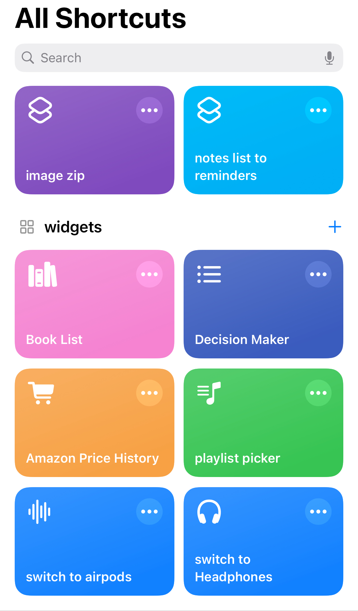

## Introduction
I’ve been a shortcuts warrior ever since I discovered it’s usage for changing app icons in iOS 14!!(that was a while ago we are on 18 now) I like to make a shortcut for any little thing that might require a repetitive task and the shortcuts app is like a for loop in your pocket. 

I’ve made shortcuts for automating my summer jobs, making decisions, and even for making my own janky Spotify Lock Screen complication. Out of all of these, the one that gets the most use( when I have internship money ) is my Amazon price history shortcut. I’ve essentially made a quick way to access the [camelcamelcamel](https://camelcamelcamel.com) price chart for an Amazon page on mobile. I’m sure there’s some sort of app that you can use that already has this but the nice thing about the shortcut is it works with the official app.

## Shortcuts quick intro

If you haven’t been introduced to the shortcuts app, it’s a built in app that comes with your iPhone, iPad and Mac! It’s a fun tool and quite powerful and feature rich for something Apple does not expect most users to utilize. They’ve added a lot of scripting tools and you can even run ssh commands through it! 

The craze around apple allowing users change their app icons (although I wouldn't call it 'allowing' if you have to do it in such a roundabout way) unfortunately overshadowed the actual uses of the shortcuts app. I've even used it to schedule texts before the `send later` feature was added in iOS 18. Check the links at the bottom of this post to see some resources and a link to my Price History one!

## The idea
It really came to fruition when I was doing some light sale searching. Maybe some heavy sale searching, I like to shop.

I'm a frequent visitor of [r/bapcsalescanada](https://reddit.com/r/bapcsalescanada) and I was tired of going to a separate website to check the price history for Amazon posts. Desktop users have a [handy extension](https://camelcamelcamel.com/) that pulls up the price data easily but I didn’t have anything like that for mobile. And so, I hit up the trusty shortcuts app. Here’s a screenshot:



## Making the shortcut

### 1. Set up input
I start with the `Get Item from List` module and set it to *First Item* from *Shortcut Input*. This let's you use the share sheet as a way to get input for the shortcut. You can also start with pressing the ⓘ button at the bottom of the page and enabling *Show in Share Sheet*. In the program flow, at the top should now be a `Receive __ input from Share Sheet` block. You can select the first option and change that to URLs, for "If there's no input:", you can select *Get Clipboard* from the dropdown. 

It should look like this:


### 2. Expanding URL
Now you can use `Get URLs from Input` to get the url. At this point, the amazon app usually gives a shortened URL in the form of:
```*https://a.co/d/wxyz123*```
We want the complete amazon URL since we will be using *charts.camelcamelcamel.com/* which needs the amazon product code in the url. We can use the `Expand URLs` module for that, this gets us the entire link. 

As an example, if you wanted to get [this](https://a.co/d/4iuR5FE) and check the price history. The share page from the amazon app would get you this link: *https://a.co/d/4iuR5FE*. The `Expand URLs` will get you the entire link(weirdly long but has what we need) which looks like:

```
https://www.amazon.ca/dp/B0DHLCRF91?ref=cm_sw_r_cp_ud_dp_3HSFY6RVZH0BVW2PD5MS&ref_=cm_sw_r_cp_ud_dp_3HSFY6RVZH0BVW2PD5MS&social_share=cm_sw_r_cp_ud_dp_3HSFY6RVZH0BVW2PD5MS&peakEvent=5&dealEvent=0&skipTwisterOG=1
```
### 3. Extracting ProductID
Now we just need some regex to get the amazon product ID. Which is the string at *amazon.ca/dp/{string here}?*. This works because camelcamelcamel also uses this string to get the right amazon page, and we just want to take their chart. You can use the `Match Text` module for getting the url, make sure the *Case Sensitive* option is toggled on. The regex I used to match this string was `\/dp\/([A-Za-z0-9]+)`. 

Our result looks like this: `/dp/BODHLCRF91`

Once you have the match, we need `Get Group from Matched Text` to access our result. Since the link signifies the product code after */dp/*, we have to make sure to get the group at index **1** to grab the ID only. 

### 4. Generating the Chart URL
The camelcamelcamel charts work with url parameters like *charts.camelcamelcamel.com/{country}/{productID}/{chart-details}*. So we can control the country, which you will need to do if you're not in canada, since product IDs will vary across countries.

I found that its nice to see the new and used graphs when I want to check a price so I have enabled those as well as the legend. But there are a lot of options you can experiment with. 

We need to add a `Text` block and then insert our variable from the match above.
```
https://charts.camelcamelcamel.com/ca/{match result}/amazon-new-used.png?legend=1
``` 


From there, we use another `Get URLs from Input` to get the URL with our injected product id which gives us the link to the camelcamelcamel chart. The *input* in this case is the `Text` module above. At this point, the shortcut is essentially complete, all we need to do is `Show Result` and we can test it in action. 

## Results 
The final structure of the shortcut looks like this:


There's a lot of room to work with in terms of QoL changes if you're doing this for yourself, like removing third party new/used or even the size of the chart itself. 

#### Customization Options  
You can tweak the chart parameters for specific needs:  
- **Legend Visibility**: Add `legend=1` or `legend=0`.  
- **Chart Type**: Modify `amazon-new-used` to show specific data:  
  - `amazon.png` → Amazon-only prices  
  - `new.png` → New prices  
  - `used.png` → Used prices  
- **Size**: Add `w=<width>&h=<height>` for custom dimensions.  
You also need to put these options separated with `&` to apply them:
```
https://charts.camelcamelcamel.com/ca/{match result}/amazon-new.png?w=700&h-450&legend=1
``` 

#### links
1. [r/shortcuts](https://reddit.com/r/shortcuts)
2. [My Price History Shortcut(iCloud link)](https://www.icloud.com/shortcuts/bc44756f7f5e4bbeb271cbc676c2d019)
