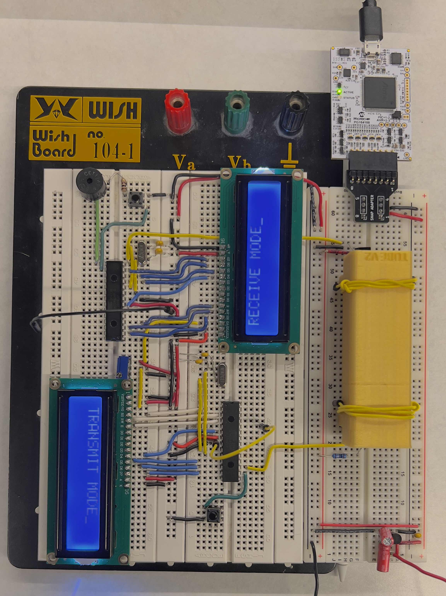

# at_morse
A morse code decoder programmed in avr-libC for the atmega328p. Find the project on [github](https://github.com/pyarya/at_morse).

## Breadboard ~ Hardware

## Schematic

## Parts List
#### Device
- ATmega328p(x2)
- HD44780 LCD Display(x2)
- IR Emitter/Receiver(x2)
- Piezo Buzzer(x2)
- Push Button(x2)
- Oscillating Crystal (8Mhz)(x2)
- Potentiometer (x1)
- 22pF Capacitors(x4)
- 1kOhm Resistor(x2)
- 10 Ohm Resistor(x2)
#### Power
- Voltage Regulator(x1)
- 10uF Capacitor(x2)
- 22pf Capacitor(x1)
- 6.2V 0.5A Wall Power Supply

